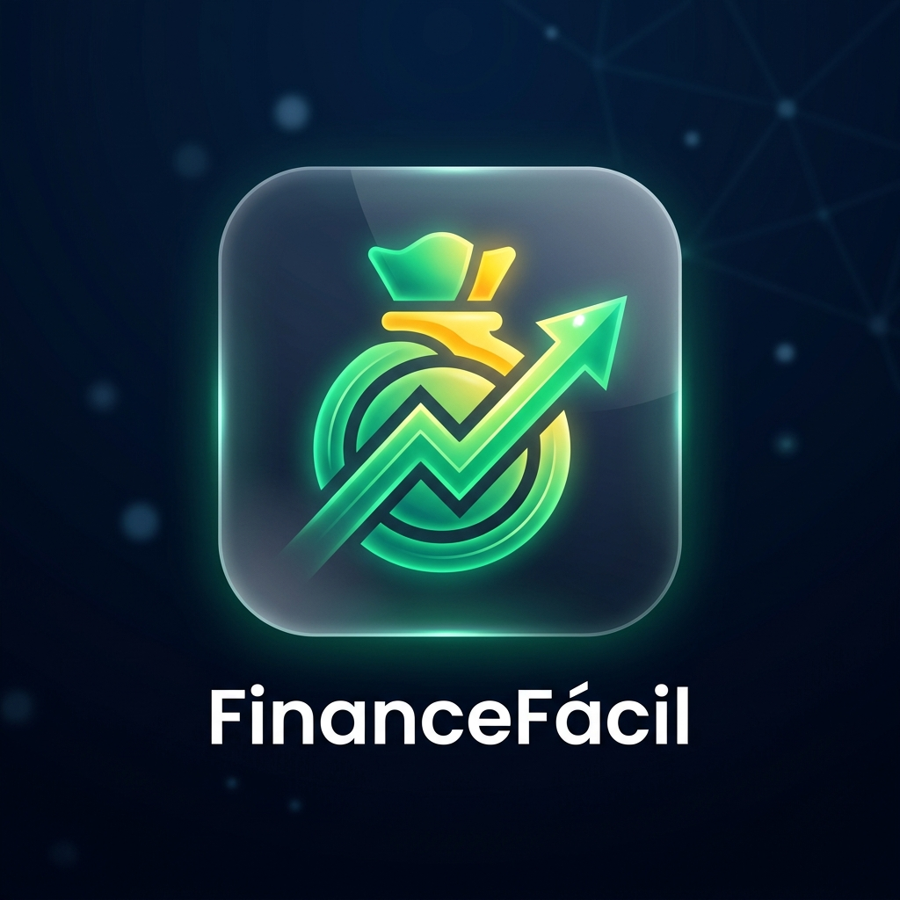

<div align="center">
  
  <h1>FinanceFácil</h1>
  <p><b>Seu guia completo de finanças pessoais e investimentos em português.</b></p>
  <p>🌐 <b>Site Oficial:</b> <a href="https://investebem.carlosandemberg.com.br/">https://investebem.carlosandemberg.com.br/</a></p>
  
  [](https://opensource.org/licenses/MIT)
  []()
  [](https://carlosandemberg.com.br)

  <p>
    <a href="#sobre">Sobre</a> •
    <a href="#ferramentas">Ferramentas</a> •
    <a href="#tecnologias">Tecnologias</a> •
    <a href="#como-usar">Como Usar</a> •
    <a href="#licença">Licença</a>
  </p>
</div>

<br>

<a id="sobre"></a>
## 📌 Sobre

O **FinanceFácil** é uma aplicação web moderna e responsiva voltada para a educação financeira do brasileiro. Desenvolvida para ser intuitiva e direta, a plataforma engloba tanto a **teoria quanto a prática**, oferecendo calculadoras avançadas, trilhas de conhecimento e um módulo de "Aprenda na Prática" para simular o mercado financeiro. Vamos investir?

Com foco na autonomia do usuário, a plataforma não exige cadastros e roda diretamente no seu navegador, armazenando seu progresso localmente de forma segura.

<a id="ferramentas"></a>
## 🛠️ Ferramentas

O FinanceFácil inclui calculadoras completas com integração **em tempo real** às APIs oficiais do Banco Central e BrasilAPI (Taxa Selic, CDI, IPCA, Dólar e Euro):

- **Juros Compostos:** Veja seu dinheiro crescer no longo prazo.
- **Aposentadoria:** Calcule quanto precisa acumular para viver de renda.
- **Financiamento:** Entenda a tabela SAC e Price antes de financiar.
- **Inflação Real:** Descubra o poder de compra e o rendimento real descontando o IPCA.
- **Regra do 72:** Descubra em quantos anos seu dinheiro vai dobrar.
- **Orçamento 50/30/20:** Organize seu salário de forma inteligente e visual.
- **Comparador Dinâmico:** Compare rentabilidades entre CDB, LCI, Poupança e Tesouro com taxas em tempo real.

<a id="tecnologias"></a>
## 💻 Tecnologias

Este projeto foi construído com foco em alta performance e SEO:

- **HTML5 & CSS3 Vanilla:** Arquitetura CSS baseada em variáveis globais, design system próprio e Glassmorphism. Acessibilidade nativa e otimizada (a11y).
- **JavaScript (ES6):** Manipulação de DOM ultrarrápida, gráficos nativos desenhados via SVG sem bibliotecas pesadas, e persistência inteligente com `localStorage`.
- **Integração de APIs:** Consumo direto da BrasilAPI e HG Brasil via `fetch`.
- **SEO & Open Graph:** Meta-tags avançadas implementadas para compartilhamento rico nas redes sociais (Twitter Cards e OG Image).

<a id="como-usar"></a>
## 🚀 Como Usar

Não há necessidade de processos complexos de build, pois o projeto não possui dependências Node.js amarradas ao frontend.

1. Clone o repositório:
```bash
git clone https://github.com/carlosandemberg/FinanceFacil.git
```
2. Abra a pasta do projeto:
```bash
cd FinanceFacil
```
3. Para visualizar, basta abrir o arquivo `index.html` em qualquer navegador ou iniciar um servidor local simples:
```bash
npx serve .
```

## 👨‍💻 Desenvolvedor

Criado com ❤️ e muito código por **Carlos Andemberg**.
- 🌐 [Website](https://carlosandemberg.com.br)

<a id="licença"></a>
## 📄 Licença

Este projeto está sob a licença MIT. Sinta-se à vontade para estudar o código, modificar e contribuir!

---
<div align="center">
  <sub>Educação financeira gratuita e acessível para todos os brasileiros.</sub>
</div>
